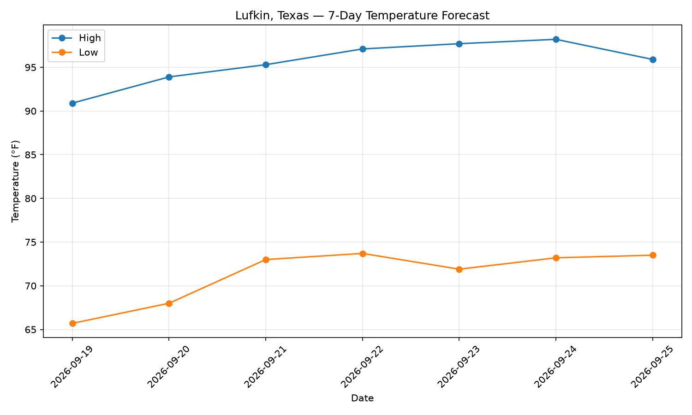
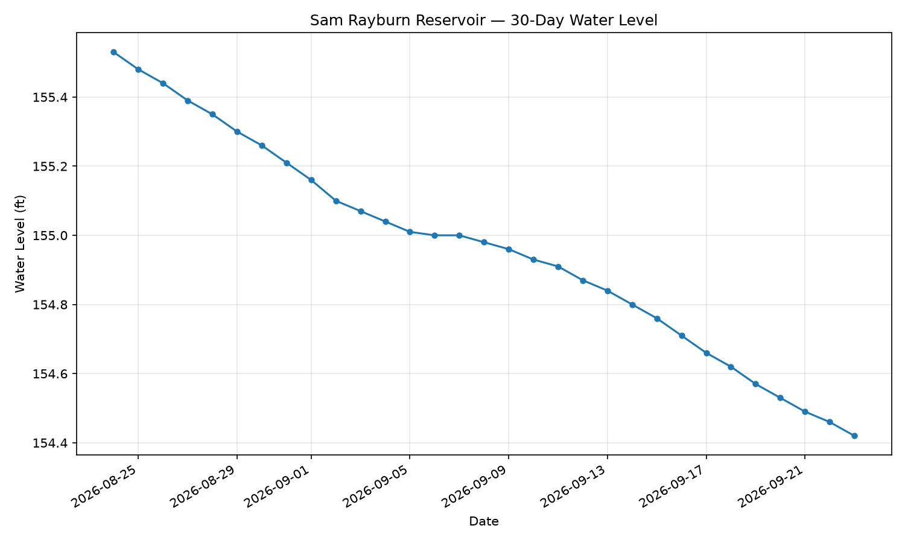

# Automated Lufkin Weather Chart

This project automatically downloads the latest Lufkin, Texas weather forecast and regenerates the chart each day using GitHub Actions.

## Current 7-Day Forecast

## Sam Rayburn Reservoir

### 30-Day Water Level

Data source: Texas Water Development Board — Water Data for Texas
## How it works

- Python downloads the latest forecast data
- Matplotlib creates the chart
- GitHub Actions runs the script automatically each day
- The updated chart is committed back to this repository
